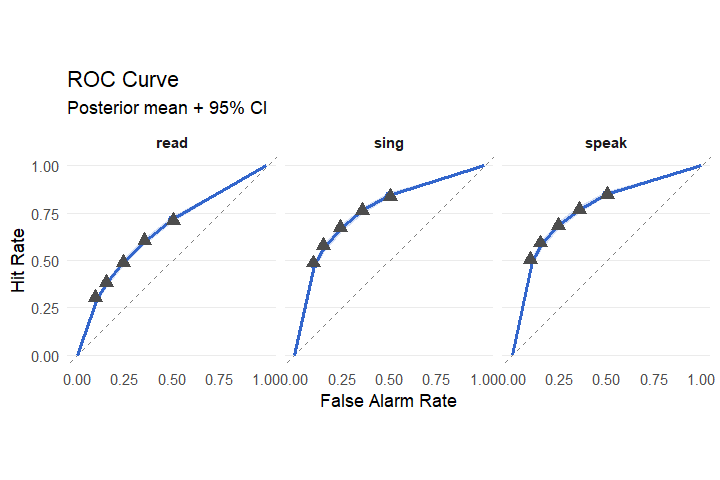
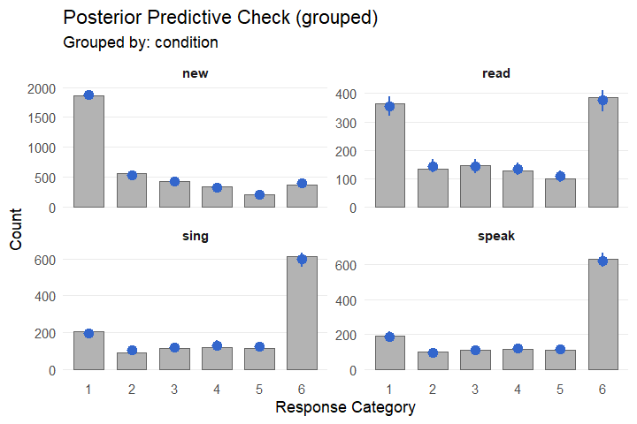
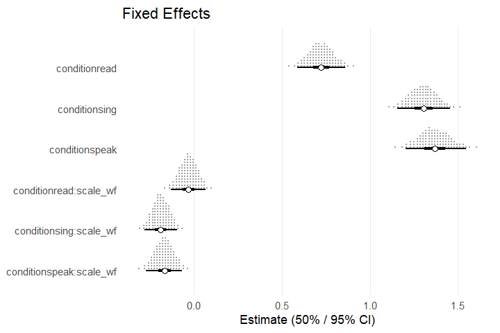
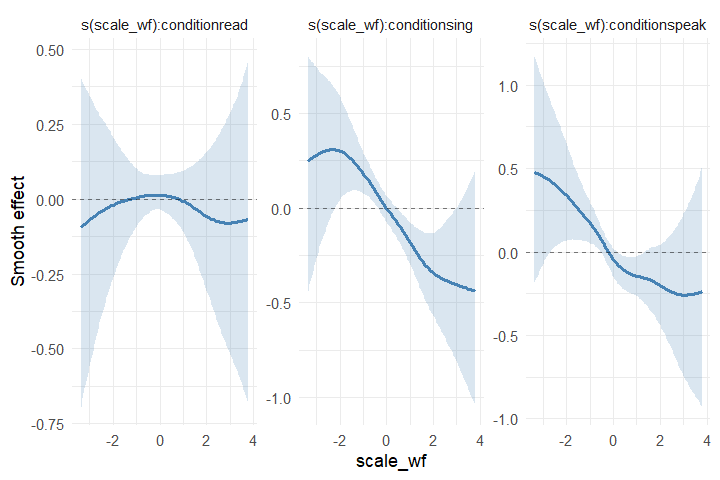

```{=html}
<style>
body { max-width: 960px; }
pre, pre code, code { white-space: pre !important; word-wrap: normal !important; }
pre { overflow-x: auto !important; }
</style>
```

## Fitting and summarizing a basic model

This tutorial demonstrates how the `bayesroc` package can be used to analyze 
recognition data from a simple cognitive experiment. Here, we will use the data
for Experiment 1B from Whitridge et al. (2024). This dataset is shipped by the 
package. We first load the package and the dataset:


```r
library(bayesroc)

data("whitridge_2024")
str(whitridge_2024)
#> 'data.frame':	7560 obs. of  6 variables:
#>  $ participant: int  26 26 26 26 26 26 26 26 26 26 ...
#>  $ words      : chr  "CONGRESS" "BENEFIT" "CRIME" "TREATMENT" ...
#>  $ scale_wf   : num  -1.053 -0.616 0.641 -0.383 -0.373 ...
#>  $ condition  : Factor w/ 4 levels "new","read","sing",..: 3 1 1 3 1 1 2 4 1 2 ...
#>  $ old        : int  1 0 0 1 0 0 1 1 0 1 ...
#>  $ conf       : int  6 3 2 6 3 2 2 5 5 3 ...
```

We have several variables we may want to include in the models we build: `conf`
contains the confidence ratings on a 6-point scale, `old` indicates whether
items were targets or lures, `condition` indicates how the item was studied 
(i.e., by speaking it aloud, singing it, or reading it silently), `scale_wf` gives 
the scaled SUBTLEX word frequency of the item (Brysbaert & New, 2009), and 
`participant` and `words` are subject- and item-level indicators. We start with
a basic equal variance model that includes fixed effects for `condition` and random effects
by subjects and items. We first specify a formula using the `brf()` function,
which requires ratings, the old/new indicator, and any predictors we want to include.
The primary formula is constructed with the form `rating | is_old ~ predictors` and 
is applied to `dprime` (or `mu` for `cumulative` families). Other model parameters require 
additional formulas:


```r
f.1 <- brf(
  conf | old ~ condition-1 + (condition-1|participant) + (condition-1|words),
  criterion ~ 1 + (1|participant) + (1|words),
  family = evsd()
)
```

Here, we remove the intercept on `dprime` for interpretability. Because the criteria depend
only on the lure distribution and `condition` only applies to targets, we specify
only intercepts in the `criterion` formula. We can then pass the formula and the data to 
the `broc()` function to construct a model:


```r
m.1 <- broc(formula = f.1,
           data = whitridge_2024,
           encoding_vars = 'condition')
print(m.1)
#> bayesroc model
#> ==============
#> Family: evsd 
#> 
#> Formula:
#> bayesroc model formula
#> ======================
#> 
#> Response: conf 
#> Condition variable: old (old/new)
#> Encoding-only variables: condition 
#> 
#> d' (dprime):
#>   Fixed: ~ 0 + condition 
#>   Random:
#>     (0 + condition | participant)
#>     (0 + condition | words)
#> 
#> Criterion:
#>   Fixed: ~ 1 (intercept only)
#>   Random:
#>     (1 | participant)
#>     (1 | words)
#> 
#> Data dimensions:
#>   N = 7560 
#>   K = 6 
#>   P_dprime = 3
#>   P_criterion = 1
```

Similar to the above point, the `encoding_vars` argument is used to indicate that
`condition` can only apply to targets, which is a common design within cognitive studies.
If we failed to specify that `condition` was an encoding variable, the model would 
estimate several meaningless parameters (e.g., `dprime` for lures) which also enter the random
effects and contaminate the covariance structure by altering the implied prior. Thus,
`encoding_vars` should always be used for manipulations that apply only to targets.

Once we have constructed a model, we can run MCMC sampling using the `fit_broc` function.
Here, we retain most of the default settings but use the NumPyro backend for speed:


```r
fit.1 <- fit_broc(
  model = m.1,
  backend = 'jax',
  seed = 999
)
#> 

summary(fit.1)
#> 
#> bayesroc model summary
#> ======================
#> Family: evsd 
#> N: 7560 | K: 6 | Chains: 4 x 2000 
#> Sampler: 0 divergent | 0 max-treedepth | min E-BFMI 0.64
#> 
#> FIXED EFFECTS
#> -------------
#> 
#> DPRIME:
#>       parameter estimate    sd lower upper  rhat ess_bulk ess_tail
#>   conditionread    0.724 0.071 0.608 0.842 1.000     5126     6253
#>   conditionsing    1.300 0.078 1.174 1.428 1.000     4924     5680
#>  conditionspeak    1.365 0.090 1.217 1.511 1.000     5324     6435
#> 
#> CRITERION THRESH MID:
#>  parameter estimate    sd lower upper  rhat ess_bulk ess_tail
#>  intercept    0.761 0.083 0.627 0.899 1.001     2423     3168
#> 
#> CRITERION GAPS:
#>             parameter estimate    sd  lower  upper  rhat ess_bulk ess_tail
#>  log_gap[1,intercept]   -1.367 0.121 -1.567 -1.167 1.003     2760     4089
#>  log_gap[2,intercept]   -1.515 0.150 -1.768 -1.273 1.001     3011     4230
#>  log_gap[3,intercept]   -1.186 0.094 -1.341 -1.033 1.001     3015     4885
#>  log_gap[4,intercept]   -1.199 0.157 -1.461 -0.945 1.004     1499     2281
#> 
#> POPULATION THRESHOLDS
#> ---------------------
#> 
#> intercept:
#>  threshold estimate    sd  lower upper
#>          1    0.149 0.104 -0.059 0.352
#>          2    0.454 0.087  0.281 0.628
#>          3    0.761 0.083  0.597 0.928
#>          4    1.018 0.075  0.869 1.170
#>          5    1.240 0.083  1.081 1.409
#> 
#> RANDOM EFFECTS (Standard Deviations)
#> ------------------------------------
#> 
#> dprime | participant:
#>           level estimate    sd lower upper  rhat ess_bulk ess_tail
#>   conditionread    0.349 0.059 0.259 0.451 1.000     5029     5371
#>   conditionsing    0.401 0.061 0.310 0.507 1.000     5706     6013
#>  conditionspeak    0.476 0.068 0.374 0.593 1.000     5783     6693
#> 
#> dprime | words:
#>           level estimate    sd lower upper  rhat ess_bulk ess_tail
#>   conditionread    0.425 0.062 0.322 0.525 1.001     2747     3941
#>   conditionsing    0.405 0.059 0.308 0.501 1.001     3383     4888
#>  conditionspeak    0.496 0.062 0.393 0.599 1.000     3241     5227
#> 
#> criterion | participant:
#>    level estimate    sd lower upper  rhat ess_bulk ess_tail
#>  thresh1    0.977 0.116 0.801 1.180 1.000     3288     4860
#>  thresh2    0.548 0.073 0.439 0.679 1.001     5085     5998
#>  thresh3    0.500 0.060 0.411 0.608 1.000     3985     5511
#>  thresh4    0.698 0.089 0.563 0.854 1.000     5132     6204
#>  thresh5    0.890 0.125 0.704 1.108 1.000     4907     5383
#> 
#> criterion | words:
#>    level estimate    sd lower upper  rhat ess_bulk ess_tail
#>  thresh1    0.252 0.061 0.149 0.349 1.002     2425     3087
#>  thresh2    0.275 0.047 0.197 0.352 1.000     5852     5851
#>  thresh3    0.253 0.027 0.210 0.297 1.002     2145     3661
#>  thresh4    0.304 0.059 0.203 0.399 1.003     2896     4843
#>  thresh5    0.277 0.060 0.179 0.375 1.000     5644     5612
#> 
#> CORRELATIONS
#> ------------
#> 
#> dprime | participant:
#>                            pair estimate    sd lower upper  rhat ess_bulk ess_tail
#>   conditionread ~ conditionsing    0.841 0.101 0.650 0.969 1.003     3161     4155
#>  conditionread ~ conditionspeak    0.675 0.142 0.412 0.876 1.002     2384     3285
#>  conditionsing ~ conditionspeak    0.854 0.085 0.692 0.963 1.002     3615     5873
#> 
#> dprime | words:
#>                            pair estimate    sd lower upper  rhat ess_bulk ess_tail
#>   conditionread ~ conditionsing    0.549 0.174 0.250 0.824 1.002     1445     1965
#>  conditionread ~ conditionspeak    0.457 0.166 0.180 0.726 1.001     1376     1875
#>  conditionsing ~ conditionspeak    0.763 0.130 0.529 0.948 1.003     1288     2484
#> 
#> criterion | participant:
#>               pair estimate    sd  lower  upper  rhat ess_bulk ess_tail
#>  thresh1 ~ thresh2    0.579 0.121  0.364  0.756 1.001     4165     5588
#>  thresh1 ~ thresh3    0.027 0.147 -0.216  0.265 1.002     2543     3877
#>  thresh1 ~ thresh4    0.518 0.129  0.286  0.712 1.002     3451     4891
#>  thresh1 ~ thresh5    0.564 0.115  0.362  0.735 1.000     4760     5650
#>  thresh2 ~ thresh3    0.011 0.160 -0.253  0.278 1.001     2204     4423
#>  thresh2 ~ thresh4    0.490 0.141  0.238  0.703 1.001     3275     4422
#>  thresh2 ~ thresh5    0.110 0.159 -0.158  0.370 1.000     4637     5690
#>  thresh3 ~ thresh4   -0.455 0.132 -0.650 -0.222 1.000     5651     6371
#>  thresh3 ~ thresh5   -0.052 0.159 -0.305  0.214 1.000     4572     6077
#>  thresh4 ~ thresh5    0.300 0.153  0.034  0.539 1.000     5091     7069
#> 
#> criterion | words:
#>               pair estimate    sd  lower  upper  rhat ess_bulk ess_tail
#>  thresh1 ~ thresh2    0.392 0.223  0.010  0.748 1.001     1239     2173
#>  thresh1 ~ thresh3   -0.206 0.216 -0.575  0.143 1.004      648      936
#>  thresh1 ~ thresh4    0.403 0.238 -0.009  0.784 1.003     1562     3596
#>  thresh1 ~ thresh5    0.417 0.238  0.007  0.786 1.001     1812     2819
#>  thresh2 ~ thresh3   -0.701 0.147 -0.912 -0.432 1.004     1165     2280
#>  thresh2 ~ thresh4    0.510 0.202  0.163  0.821 1.002     1604     3766
#>  thresh2 ~ thresh5    0.684 0.172  0.357  0.917 1.001     3799     5583
#>  thresh3 ~ thresh4   -0.462 0.168 -0.725 -0.178 1.000     3740     5306
#>  thresh3 ~ thresh5   -0.730 0.141 -0.923 -0.461 1.000     5397     6788
#>  thresh4 ~ thresh5    0.483 0.224  0.086  0.822 1.000     5329     6117
```

The summary of the fitted model object contains estimates, CIs, and diagnostics for 
all parameters. Note that for thresholds, there are K-1 correlated random
intercepts per grouping level. To ensure monotonicity, thresholds are constructed as
a midpoint (i.e., threshold 3 for K = 6) and log-scale offsets. When no continuous
covariates are specified, `summary.broc_fit()` reconstructs the natural scale
population-level thresholds. If we also want to put the threshold correlations on 
a more interpretable scale, we can pass an additional argument to our summary call:


```r
summary(fit.1,
        threshold_natural = TRUE)$threshold_natural
#> 
#> criterion | participant:
#>               pair estimate    sd lower upper
#>  thresh1 ~ thresh2    0.877 0.016 0.844 0.906
#>  thresh1 ~ thresh3    0.710 0.033 0.643 0.772
#>  thresh1 ~ thresh4    0.455 0.058 0.337 0.562
#>  thresh1 ~ thresh5    0.235 0.065 0.104 0.359
#>  thresh2 ~ thresh3    0.926 0.015 0.893 0.952
#>  thresh2 ~ thresh4    0.741 0.038 0.661 0.809
#>  thresh2 ~ thresh5    0.591 0.048 0.491 0.680
#>  thresh3 ~ thresh4    0.894 0.019 0.852 0.928
#>  thresh3 ~ thresh5    0.757 0.033 0.688 0.818
#>  thresh4 ~ thresh5    0.909 0.017 0.873 0.938
#> 
#> criterion | words:
#>               pair estimate    sd lower upper
#>  thresh1 ~ thresh2    0.974 0.016 0.936 0.996
#>  thresh1 ~ thresh3    0.941 0.030 0.872 0.985
#>  thresh1 ~ thresh4    0.846 0.062 0.702 0.945
#>  thresh1 ~ thresh5    0.731 0.104 0.496 0.898
#>  thresh2 ~ thresh3    0.980 0.012 0.950 0.996
#>  thresh2 ~ thresh4    0.906 0.044 0.801 0.971
#>  thresh2 ~ thresh5    0.810 0.082 0.622 0.938
#>  thresh3 ~ thresh4    0.943 0.031 0.864 0.987
#>  thresh3 ~ thresh5    0.865 0.068 0.700 0.962
#>  thresh4 ~ thresh5    0.963 0.027 0.889 0.994
```
We can also pass the fitted model to other useful functions, such as 
`plot_roc_curve()` or `pp_check.broc_fit()`:


```r
plot_roc_curve(fit.1,
               group = 'condition')
```



```r
pp_check(fit.1,
         type = 'bars_grouped',
         group = 'condition')
```



## Prior adjustment, model comparison, and smooth terms

To explore other capabilities of the package, we can expand our model by adding a
continuous covariate. To do so, we first specify a new formula. Encoding variables
can also be specified in the model formula:


```r
f.2 <- brf(
  conf | old ~ condition+condition:scale_wf-1 + 
    (condition+condition:scale_wf-1|participant) + 
    (condition-1|words),
  criterion ~ scale_wf + (scale_wf|participant) + (1|words),
  family = evsd(),
  encoding_vars = 'condition'
)
```

We probably want to adjust the default priors here. We can view the default priors
and coefficient names for a model before constructing it by passing the formula and
data to `get_broc_prior()`, and we can then specify the priors we want to override:


```r
get_broc_prior(f.2, 
               whitridge_2024)
#>    class       dpar                    coef       group                prior  source
#> 1      b     dprime           conditionread        <NA>         normal(1, 1) default
#> 2      b     dprime           conditionsing        <NA>         normal(1, 1) default
#> 3      b     dprime          conditionspeak        <NA>         normal(1, 1) default
#> 4      b     dprime  conditionread:scale_wf        <NA>         normal(1, 1) default
#> 5      b     dprime  conditionsing:scale_wf        <NA>         normal(1, 1) default
#> 6      b     dprime conditionspeak:scale_wf        <NA>         normal(1, 1) default
#> 7      b thresh_mid             (Intercept)        <NA>       normal(0, 1.5) default
#> 8      b thresh_mid                scale_wf        <NA>       normal(0, 1.5) default
#> 9      b   log_gaps        gap1_(Intercept)        <NA>         normal(0, 1) default
#> 10     b   log_gaps           gap1_scale_wf        <NA>         normal(0, 1) default
#> 11     b   log_gaps        gap2_(Intercept)        <NA>         normal(0, 1) default
#> 12     b   log_gaps           gap2_scale_wf        <NA>         normal(0, 1) default
#> 13     b   log_gaps        gap3_(Intercept)        <NA>         normal(0, 1) default
#> 14     b   log_gaps           gap3_scale_wf        <NA>         normal(0, 1) default
#> 15     b   log_gaps        gap4_(Intercept)        <NA>         normal(0, 1) default
#> 16     b   log_gaps           gap4_scale_wf        <NA>         normal(0, 1) default
#> 17    sd     dprime           conditionread participant       normal(0, 0.5) default
#> 18    sd     dprime           conditionsing participant       normal(0, 0.5) default
#> 19    sd     dprime          conditionspeak participant       normal(0, 0.5) default
#> 20    sd     dprime  conditionread:scale_wf participant       normal(0, 0.5) default
#> 21    sd     dprime  conditionsing:scale_wf participant       normal(0, 0.5) default
#> 22    sd     dprime conditionspeak:scale_wf participant       normal(0, 0.5) default
#> 23    sd     dprime           conditionread       words       normal(0, 0.5) default
#> 24    sd     dprime           conditionsing       words       normal(0, 0.5) default
#> 25    sd     dprime          conditionspeak       words       normal(0, 0.5) default
#> 26    sd  criterion             (Intercept) participant       normal(0, 0.5) default
#> 27    sd  criterion                scale_wf participant       normal(0, 0.5) default
#> 28    sd  criterion             (Intercept)       words       normal(0, 0.5) default
#> 29   cor     dprime                    <NA> participant lkj_corr_cholesky(1) default
#> 30   cor     dprime                    <NA>       words lkj_corr_cholesky(1) default
#> 31   cor  criterion                    <NA> participant lkj_corr_cholesky(1) default
#> 32   cor  criterion                    <NA>       words lkj_corr_cholesky(1) default
m.2.priors <- c(
  broc_prior('normal(0, 0.5)', 
             class = 'b', 
             dpar = 'dprime', 
             coef = 'conditionread:scale_wf'),
  broc_prior('normal(0, 0.5)', 
             class = 'b', 
             dpar = 'dprime', 
             coef = 'conditionsing:scale_wf'),
  broc_prior('normal(0, 0.5)', 
             class = 'b', 
             dpar = 'dprime', 
             coef = 'conditionspeak:scale_wf')
)
```

We can then construct the model including our priors and run sampling:


```r
m.2 <- broc(formula = f.2,
            priors = m.2.priors,
            data = whitridge_2024)
fit.2 <- fit_broc(
  model = m.2,
  backend = 'jax',
  seed = 999
)
#> 

summary(fit.2)$fixed
#> $dprime
#>                 parameter estimate    sd  lower  upper  rhat ess_bulk ess_tail
#> 1           conditionread    0.723 0.070  0.609  0.839 1.000     4492     5585
#> 2           conditionsing    1.304 0.077  1.180  1.433 1.000     4670     5467
#> 3          conditionspeak    1.369 0.088  1.227  1.518 1.000     5017     5641
#> 4  conditionread:scale_wf   -0.031 0.050 -0.113  0.050 1.000     9344     6580
#> 5  conditionsing:scale_wf   -0.188 0.047 -0.265 -0.111 1.001    10630     6711
#> 6 conditionspeak:scale_wf   -0.167 0.053 -0.254 -0.082 1.000     9880     6353
#> 
#> $criterion_thresh_mid
#>   parameter estimate    sd  lower  upper  rhat ess_bulk ess_tail
#> 1 intercept    0.764 0.081  0.633  0.898 1.002     2449     3883
#> 2  scale_wf   -0.074 0.026 -0.117 -0.031 1.000    12031     6712
#> 
#> $criterion_gaps
#>              parameter estimate    sd  lower  upper  rhat ess_bulk ess_tail
#> 1 log_gap[1,intercept]   -1.363 0.116 -1.555 -1.177 1.000     3227     5274
#> 2  log_gap[1,scale_wf]    0.017 0.041 -0.050  0.084 1.001    14523     6318
#> 3 log_gap[2,intercept]   -1.511 0.148 -1.759 -1.279 1.000     3005     4488
#> 4  log_gap[2,scale_wf]    0.017 0.046 -0.060  0.091 1.001    14398     6122
#> 5 log_gap[3,intercept]   -1.183 0.093 -1.338 -1.034 1.000     3397     5027
#> 6  log_gap[3,scale_wf]    0.090 0.036  0.031  0.148 1.001    13791     6173
#> 7 log_gap[4,intercept]   -1.194 0.155 -1.451 -0.943 1.001     1284     2140
#> 8  log_gap[4,scale_wf]    0.076 0.032  0.025  0.129 1.000    13429     6445
```

We can create a quick plot of fixed effects on `dprime` using the `plot.broc_fit` method:


```r
plot(fit.2, type = 'dots')
```



And we can compare the two models we've fit via PSIS-LOO (Vehtari et al., 2017):


```r
loo.1 <- loo(fit.1,
             cores = 10)
loo.2 <- loo(fit.2,
             cores = 10)
loo_compare(loo.1, loo.2)
#>        elpd_diff se_diff
#> model2  0.0       0.0   
#> model1 -6.3       6.1
```

The `loo.broc_fit()` method supports multicore computation (even for Windows users) via
PSOCK clusters. Other functions like `predict.broc_fit()` and `pp_check.broc_fit()`, among
others, also support this. It is highly recommended to use as many cores as possible when 
dealing with PSIS-LOO computation or prediction for large models. 

As an exercise, we could also try modeling word frequency as a smooth term rather than
a linear effect. `bayesroc` interfaces with the `mgcv` package (Wood, 2011) to accomplish 
this. To avoid creating an extremely heavy model for an example, we only use a simple
population-level smooth term on `dprime`, but the package supports any smooth term that can be
constructed using the `s()` or `t2()` functions from `mgcv` on any parameter. 


```r
f.3 <- brf(
  conf | old ~ condition-1+s(scale_wf, by = condition) + 
    (condition-1|participant) + (condition-1|words),
  criterion ~ scale_wf + (scale_wf|participant) + (1|words),
  family = evsd(),
  encoding_vars = 'condition'
)
m.3.priors <- c(
  broc_prior('std_normal()', class = 'sds')
)
m.3 <- broc(formula = f.3,
            priors = m.3.priors,
            data = whitridge_2024)
fit.3 <- fit_broc(
  model = m.3,
  backend = 'jax',
  seed = 999
)
#> 
```

We can visualize the conditional smooths from this model and investigate whether the 
smooth term improved out-of-sample prediction:


```r
plot(conditional_smooths(fit.3))
```



```r
loo.3 <- loo(fit.3,
             cores = 10)
loo_compare(loo.1, loo.2, loo.3)
#>        elpd_diff se_diff
#> model3  0.0       0.0   
#> model2 -2.1       2.9   
#> model1 -8.4       5.5
```

## Other signal detection model families

As a final exercise, we return to the original condition-only model and consider other 
model families supported by `bayesroc`. We can fit the unequal variance signal 
detection model by changing the family argument and specifying an additional formula 
for the `sigma` parameter. Given that `dprime` and `sigma` are typically correlated, we introduce
`|p|` and `|w|` indicators in the formula to allow for correlated random effects across
parameters:


```r
f.4 <- brf(
  conf | old ~ condition-1 + (condition-1|p|participant) + (condition-1|w|words),
  sigma ~ condition-1 + (condition-1|p|participant) + (condition-1|w|words),
  criterion ~ 1 + (1|participant) + (1|words),
  family = uvsd()
)
m.4 <- broc(formula = f.4,
            data = whitridge_2024,
            encoding_vars = 'condition')
fit.4 <- fit_broc(
  model = m.4,
  backend = 'jax',
  seed = 999
)
#> 
summary(fit.4)$fixed
#> $dprime
#>        parameter estimate    sd lower upper  rhat ess_bulk ess_tail
#> 1  conditionread    0.778 0.080 0.647 0.911 1.001     5800     6440
#> 2  conditionsing    1.442 0.094 1.292 1.597 1.000     6009     6644
#> 3 conditionspeak    1.515 0.108 1.339 1.696 1.000     6823     6338
#> 
#> $sigma
#>        parameter estimate    sd lower upper  rhat ess_bulk ess_tail scale
#> 1  conditionread    0.175 0.059 0.081 0.274 1.000     7143     6132 (log)
#> 2  conditionsing    0.229 0.055 0.138 0.317 1.000     7762     6678 (log)
#> 3 conditionspeak    0.207 0.056 0.115 0.298 1.001     8306     5278 (log)
#> 
#> $criterion_thresh_mid
#>   parameter estimate    sd lower upper  rhat ess_bulk ess_tail
#> 1 intercept     0.79 0.089 0.644 0.935 1.003     2437     3640
#> 
#> $criterion_gaps
#>              parameter estimate    sd  lower  upper  rhat ess_bulk ess_tail
#> 1 log_gap[1,intercept]   -1.249 0.120 -1.447 -1.054 1.001     2738     4773
#> 2 log_gap[2,intercept]   -1.373 0.153 -1.625 -1.127 1.001     3197     4923
#> 3 log_gap[3,intercept]   -1.089 0.097 -1.250 -0.934 1.000     2859     4237
#> 4 log_gap[4,intercept]   -1.114 0.155 -1.371 -0.866 1.002     1472     2488
```

As is typical, our estimates of `sigma` are larger than one and our estimates of
`dprime` have increased relative to our initial equal variance model. Fitting other types
of signal detection models follows the same general logic. For example, fitting the basic
equal variance version of the dual process signal detection model (DPSD; Yonelinas, 1994) can
be done by specifying the correct family and adding a formula for `lambda`, which represents
the probability of recollection for this family:


```r
f.5 <- brf(
  conf | old ~ condition-1 + (condition-1|p|participant) + (condition-1|w|words),
  lambda ~ condition-1 + (condition-1|p|participant) + (condition-1|w|words),
  criterion ~ 1 + (1|participant) + (1|words),
  family = dpsd()
)
m.5 <- broc(formula = f.5,
            data = whitridge_2024,
            encoding_vars = 'condition')
fit.5 <- fit_broc(
  model = m.5,
  backend = 'jax',
  seed = 999
)
#> 
summary(fit.5)$fixed
#> $dprime
#>        parameter estimate    sd lower upper  rhat ess_bulk ess_tail
#> 1  conditionread    0.400 0.060 0.301 0.498 1.000     4217     4781
#> 2  conditionsing    0.983 0.096 0.833 1.145 1.002     1964     4394
#> 3 conditionspeak    0.947 0.102 0.788 1.123 1.001     2618     4761
#> 
#> $lambda
#>        parameter estimate    sd  lower  upper rhat ess_bulk ess_tail   scale
#> 1  conditionread   -2.231 0.285 -2.728 -1.794    1     7387     6430 (logit)
#> 2  conditionsing   -1.301 0.249 -1.738 -0.923    1     4656     5273 (logit)
#> 3 conditionspeak   -1.156 0.258 -1.600 -0.760    1     4645     5356 (logit)
#> 
#> $criterion_thresh_mid
#>   parameter estimate    sd lower upper  rhat ess_bulk ess_tail
#> 1 intercept    0.796 0.089 0.653 0.945 1.003     2007     3337
#> 
#> $criterion_gaps
#>              parameter estimate    sd  lower  upper  rhat ess_bulk ess_tail
#> 1 log_gap[1,intercept]   -1.174 0.118 -1.368 -0.982 1.002     2143     4398
#> 2 log_gap[2,intercept]   -1.150 0.166 -1.425 -0.878 1.000     2749     4581
#> 3 log_gap[3,intercept]   -1.068 0.096 -1.228 -0.914 1.002     2501     3811
#> 4 log_gap[4,intercept]   -1.125 0.153 -1.383 -0.883 1.002     1260     2325
```

Adding a formula for sigma to `f.5` would allow us to fit the superset DPSD model 
(Onyper et al., 2010). The `mixture()` family again follows the same logic. To fit the
simplified "contamination" mixture model (DeCarlo, 2002), where unattended target items 
are fixed at Normal(0, 1), a formula on `lambda` is all that is required. For this model, 
`lambda` represents the probability of attending to targets.


```r
f.6 <- brf(
  conf | old ~ condition-1 + (condition-1|p|participant) + (condition-1|w|words),
  lambda ~ condition-1 + (condition-1|p|participant) + (condition-1|w|words),
  criterion ~ 1 + (1|participant) + (1|words),
  family = mixture()
)
m.6 <- broc(formula = f.6,
            data = whitridge_2024,
            encoding_vars = 'condition')
fit.6 <- fit_broc(
  model = m.6,
  backend = 'jax',
  seed = 999
)
#> 
summary(fit.6)$fixed
#> $dprime
#>        parameter estimate    sd lower upper  rhat ess_bulk ess_tail
#> 1  conditionread    1.363 0.198 1.053 1.708 1.002     1542     2750
#> 2  conditionsing    1.771 0.138 1.551 2.002 1.003     2249     3942
#> 3 conditionspeak    1.782 0.147 1.546 2.030 1.001     3329     5595
#> 
#> $lambda
#>        parameter estimate    sd  lower upper  rhat ess_bulk ess_tail   scale
#> 1  conditionread    0.216 0.360 -0.368 0.812 1.002     1819     3722 (logit)
#> 2  conditionsing    1.510 0.304  1.049 2.034 1.002     3479     5641 (logit)
#> 3 conditionspeak    1.773 0.359  1.239 2.404 1.001     3560     5940 (logit)
#> 
#> $criterion_thresh_mid
#>   parameter estimate    sd lower upper  rhat ess_bulk ess_tail
#> 1 intercept    0.787 0.091 0.637 0.934 1.003     2016     3525
#> 
#> $criterion_gaps
#>              parameter estimate    sd  lower  upper  rhat ess_bulk ess_tail
#> 1 log_gap[1,intercept]   -1.227 0.121 -1.427 -1.029 1.001     2499     4053
#> 2 log_gap[2,intercept]   -1.362 0.151 -1.616 -1.120 1.000     2751     4547
#> 3 log_gap[3,intercept]   -1.071 0.098 -1.235 -0.914 1.001     2499     3960
#> 4 log_gap[4,intercept]   -1.106 0.155 -1.370 -0.858 1.002     1376     2553
```

The mixture family is flexible. Although this variant assumes that unattended targets are
treated like lures, specifying a formula for `dprime2` allows the mean of the unattended
distribution to vary. This can be combined with formulas on `sigma` and `sigma2` for unequal
variance mixture models, and with `dprime_L`, `lambda_L`, and `sigma_L` to allow the lure
distribution to be a mixture of no-signal and higher signal items.

## References

Brysbaert, M., & New, B. (2009). Moving beyond Kučera and Francis: A critical
evaluation of current word frequency norms and the introduction of a new and
improved word frequency measure for American English. *Behavior Research
Methods*, *41*, 977–990. https://doi.org/10.3758/BRM.41.4.977

DeCarlo, L. T. (2002). Signal detection theory with finite mixture
distributions: Theoretical developments with applications to recognition memory.
*Psychological Review*, *109*(4), 710–721. https://doi.org/10.1037/0033-295X.109.4.710

Onyper, S. V., Zhang, Y. X., & Howard, M. W. (2010). Some-or-none recollection:
Evidence from item and source memory. *Journal of Experimental Psychology:
General*, *139*(2), 341–364. https://doi.org/10.1037/a0018926

Vehtari, A., Gelman, A., & Gabry, J. (2017). Practical Bayesian model evaluation
using leave-one-out cross-validation and WAIC. *Statistics and Computing*, *27*,
1413–1432. https://doi.org/10.1007/s11222-016-9696-4

Whitridge, J. W., Huff, M. J., Ozubko, J. D., Bürkner, P.-C., Lahey, C. D., &
Fawcett, J. M. (2024). Singing does not necessarily improve memory more than
reading aloud. *Experimental Psychology*, *71*(1), 33–50.
https://doi.org/10.1027/1618-3169/a000614

Wood, S. N. (2011). Fast stable restricted maximum likelihood and marginal
likelihood estimation of semiparametric generalized linear models. *Journal of
the Royal Statistical Society: Series B (Statistical Methodology)*, *73*, 3–36.
https://doi.org/10.1111/j.1467-9868.2010.00749.x

Yonelinas, A. P. (1994). Receiver-operating characteristics in recognition
memory: Evidence for a dual-process model. *Journal of Experimental Psychology:
Learning, Memory, and Cognition*, *20*(6), 1341–1354. https://doi.org/10.1037/0278-7393.20.6.1341

